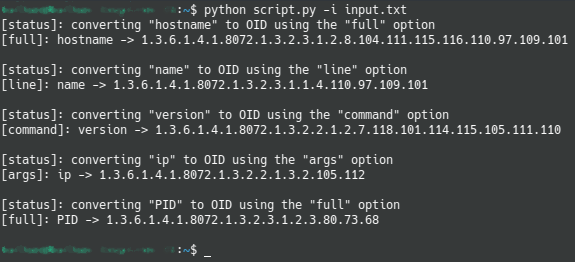

# PythonScripts

## **Description**

A repository used to store and collect all sorts of useful python scripts

---
## **Installation**

To install any of the scripts used in this repository, you just need to download the script you'd like and run it using python or like any bash script.

---

## **Scripts**

- [Convert File content to OIDs](#file-content-to-oids) 
- 

### **File content to OIDs**

#### *Description*

<!-- TODO: rework the description section -->

This script is used to convert strings to their corresponding OID value. An OID is basiclly in two parts, one being the kind of content you want to get (see [here](http://www.oidview.com/mibs/8072/NET-SNMP-EXTEND-MIB.html) for more infos) and a set of values corresponding to the length of the string and the ASCII values of each of it's characters separated by dots (ex: test -> 4.116.101.115.116). A list of options can be called too, to change the result of the SNMP request you'll use, see **Options list** section. For a detailled example, please refer to the **Usage** section.

#### *Options list*

Here are the default available options:

| Name    	| Description                         	| OID                          	|
|---------	|-------------------------------------	|------------------------------	|
| full    	| the full output                     	| 1.3.6.1.4.1.8072.1.3.2.3.1.2 	|
| line    	| the first line of the output        	| 1.3.6.1.4.1.8072.1.3.2.3.1.1 	|
| command 	| the command called                  	| 1.3.6.1.4.1.8072.1.3.2.2.1.2 	|
| args    	| the arguments of the command called 	| 1.3.6.1.4.1.8072.1.3.2.2.1.3 	|

#### *Configuration*

If you want to extend the number of options available, you simply need to add it in the dictionary called `OPTIONS_LIST`.

#### *Usage*

To use this script properly, you'll need to write a file containing the names you want to translate to OIDs as well as their option. Here is an exemple:

```
hostname full
name line
version command
ip args
PID
```

*Note:*

Notice that if no option is specified the script will use the `full` option as default.

Then all you need is to call the script as you would usally do:

```bash
python script.py
```
*Note:*

The default value for the input file path is "input.txt", but if your file path is different, you can use the **-i** or the **--input** option to specify the file path.

```bash
python script.py -i <yourFilePath>
python script.py --input <yourFilePath>
```

Here is an output example using the file above:



---